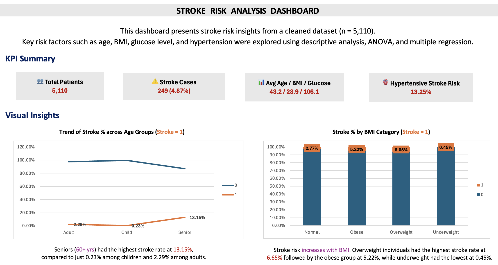

# Stroke-Risk-Analysis-Excel-Dashboard  
**Stroke Prediction with EDA, ANOVA & Multiple Regression in Excel | Dashboard & Insights**

A data-driven project using Microsoft Excel to explore patterns and predictors of stroke from patient health records. This end-to-end analysis covers data cleaning, descriptive statistics, ANOVA, regression modeling, and interactive visualizations — showcasing strong skills in data analytics, healthcare consulting, and public health communication.

---

## 📌 Objective  
To identify key risk factors associated with stroke using a cleaned healthcare dataset and generate actionable insights through statistical and visual analysis.

---

🔧 **Tools & Techniques**  
- **Excel (Advanced)**: Pivot tables, formulas, charting, dashboards  
- **Statistical Analysis**: ANOVA, Multiple Linear Regression  
- **Data Visualization**: Clustered columns, histograms, KPI boxes  
- **Public Health Skills**: Risk factor interpretation, Health disparities analysis

---

## 📊 Dataset Summary  
- **Rows:** 5,110 patient records  
- **Target Variable:** Stroke occurrence (0 = No, 1 = Yes)  
- **Independent Variables:** Age, BMI, Glucose level, Hypertension, etc.

⚠️ **Note**: Only 249 cases had a stroke (~4.87%)*, but the project still reveals meaningful differences and trends across subgroups.

---

## 📂 Dataset Used  
- **Source:** [Stroke Prediction Dataset – Kaggle](https://www.kaggle.com/datasets/fedesoriano/stroke-prediction-dataset)  
- **License:** Openly available for academic and personal use via Kaggle  
- **Size:** 5,110 patient records × 12 variables  
- **Key Features:**  
  - `gender`, `age`, `hypertension`, `heart_disease`, `ever_married`, `work_type`, `Residence_type`, `avg_glucose_level`, `bmi`, `smoking_status`, and `stroke`  
- **Target Variable:** `stroke` (1 = stroke occurred, 0 = no stroke)

📌 The original dataset was cleaned and transformed in Excel:
- Missing values in `bmi` were handled  
- “Unknown” smoking statuses were cleaned  
- New features like **age group** and **BMI categories** were created

---

## 🔍 Project Workflow  

1. **Data Cleaning & Preprocessing**  
   - Handled missing BMI values and "Unknown" smoking status  
   - Created grouped categories (e.g., Age Group, BMI Category)  
   - Cleaned all columns, removed duplicates

2. **Descriptive Analytics**  
   - Summarized key variables (Age, BMI, Glucose)  
   - Created % stroke rates for categorical subgroups using pivot tables  

3. **Statistical Analysis**  
   - **ANOVA**: Stroke patients had significantly higher Glucose (p < 0.0001) and BMI (p < 0.01)  
   - **Multiple Regression**: Age, Glucose, BMI, and Hypertension significantly predicted stroke (R² = 0.072)

4. **Visual Dashboard**  
   - Interactive charts for stroke % by age group, glucose level, BMI category, and hypertension  
   - Key KPIs, trends, and summary insights all in one dashboard

---

## 💡 Key Insights  
🔹 **Age**: Seniors (60+) had a stroke rate of 13.15% — highest among all groups  
🔹 **Glucose**: Diabetic individuals had a 10.12% stroke risk  
🔹 **BMI**: Overweight category showed highest stroke % (6.65%)  
🔹 **Hypertension**: Stroke rate for hypertensive patients was 13.25% vs 3.97% for non-hypertensive  

---

## 📷 Dashboard Preview  

---

## 📁 File Structure  
- `StrokeAnalysis_Excel_Sowmya.xlsx` – Full project workbook with formulas, analysis, and dashboard  
- **Sheet breakdown**:  
  - Original Kaggle Dataset  
  - Cleaned Data  
  - Descriptive Stats  
  - Pivot Tables & Charts  
  - ANOVA Results  
  - Regression Model  
  - Dashboard (Final Output)

---

📌 **Real-World Healthcare Applications:**

This analysis mirrors how public health agencies, healthcare consultants, and clinical analysts use data to identify stroke risk factors within populations. Insights from this project can help guide preventive strategies, patient education, resource allocation, and policy decisions to reduce stroke incidence. Understanding patterns in risk factors like age, glucose, BMI, and hypertension supports more targeted healthcare interventions and improved health outcomes at both the individual and community level.

---

## 👩🏻‍💻 About Me  
Created by **Sowmya Deshpande** — MPH Candidate | Data Analyst in Training | Healthcare Consulting Extern  
🔗 [LinkedIn](https://linkedin.com/in/sowmyadeshpande) | 🌐 [GitHub](https://github.com/DeshpandeSowmya)
